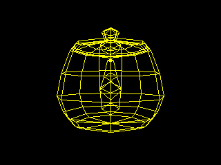
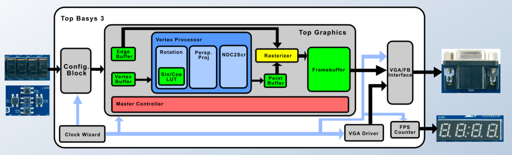

# Grafică 3D, implementată pe FPGA
**Randare 3D în timp real implementată hardware pe FPGA (Verilog).**

## Descriere proiect
Acest proiect implementează un pipeline pentru grafica 3D, optimizat pentru arhitectura FPGA. Sistemul transformă modelele 3D în pixeli afișabili în timp real, utilizând exclusiv aritmetică în virgulă fixă (format Q) semnată, pentru un consum minim de resurse hardware și latență scăzută.

Arhitectura modulară separă clar etapele de transformare geometrică, rasterizare și control al memoriei, permițând paralelizarea fluxului de date și un control complet determinist.



*Fig 1. Vizualizarea wireframe a modelului 3D, obținută prin conversia directă a dump-ului de memorie din Framebuffer în format .bmp*

---

## Changelog (v0.9.1.)

- **FPS Counter:** Implementare pe 2 afișoare cu 7 segmente a FPS-ului real: numărul de frame_done-uri într-o secundă.
- **Interfață VGA (BASYS 3):** Implementarea modulului de sincronizare VGA (HSYNC, VSYNC), compatibil cu BASYS 3. 
- **Camera dinamică:** Rotatia, distanta focala si pozitia camerei sunt determinate de butoanele/switch-urile de pe BASYS 3.
- **Automatizare parametri model:** Numarul de varfuri/muchii ai modelului si lățimea memoriilor sunt controlate de un header dedicat.
- **Implementare double framebuffer:** Pentru a evita fenomenul de tearing, am dublat numărul de FB-uri, în detrimentul cantității de memorie.
---

## TODO (ptr v1.0.)

- [ ] **Point Buffer Data Type:** VP trebuie să elimine date de forma COORD_BITS, nu Q16.12 pentru point_buffer; eliminare funcție din master_controller.
- [ ] **Z-Clipping (Clip Space):** Adăugarea parametrilor de clampare (planul NEAR și planul FAR) pentru a evita artefactele vizuale cauzate de valorile extreme pe axa Z și diviziunea cu zero în perspectiva 3D.
- [ ] **Data Safety:** Implementarea detecției și tratării complete a cazurilor de **Underflow** (și Overflow) pe tot lanțul aritmetic. Esențial înainte de a adăuga calcule complexe de rasterizare.

---

## Structură Repository

```text
├── src/                # Codul sursă Verilog (Modulele hardware)
├── useful_scripts/     # Scripturi Python utile: calcularea valorilor LUT-ului sin/cos și transformarea modelului din .obj in .mem
├── hdmi_demo/          # Prototip implementat în C a pipeline-ului 3D
├── vivado/             # Fișierele de rulare a proiectului în mediul de dezvoltare Vivado
└── rgb2dvi/            # IP-ul RGB2DVI, utilizat pentru serializarea datelor RGB
```

---

## Arhitectura Sistemului



*Fig 2. Schema bloc a arhitecturii proiectului.*

### 1. Primitive Aritmetice Custom (Format Q)
Toate modulele suportă lungime de bit parametrizabilă și includ logică dedicată pentru gestionarea limitelor numerice:
* **Q-Adder/Subtractor:** Implementare cu saturare hardware și semnalizare pentru overflow.
* **Q-Multiplier:** Gestionare automată a alinierii punctului fix după efectuarea produsului, folosind algoritmul iterativ de multiplicare Booth a numerelor întregi.
* **Q-Divider:** Implementare secvențială, bazată pe o mașină de stări (FSM) pentru economisirea resurselor logice (LUTs).

### 2. Pipeline Geometric (Vertex Processing)
* **Rotation Unit:** Aplică rotații 3D (Pitch, Yaw, Roll) folosind funcții trigonometrice precalculate.
* **Projection Unit:** Execută transformarea de perspectivă bazată pe FSM.
* **NDC to Screen:** Mapează coordonatele din spațiul normalizat (NDC) pe rezoluția fizică a framebuffer-ului.
* **Vertex Processor (Top Level):** Orchestrează modulele de mai sus într-un flux de tip pipeline.

### 3. Arhitectura de Memorie
* **Vertex Buffer:** Definește vertecșii modelului 3D, precedând etapa de transformări geometrice.
* **Edge Buffer:** Definește muchiile (conexiunile dintre vertecși) pentru etapa de rasterizare.
* **Point Buffer:** Stochează vertecșii transformați și proiectați.
* **Double Framebuffer:** Memorie video compactată (bit-packed, 32 pixeli per cuvânt de memorie) pentru stocarea imaginii finale. Citit sincron de video controller-ul pe domeniul `pixel_clk`.

### 4. Rasterizare
* **Bresenham Line Generator:** Implementare hardware a algoritmului Bresenham. Unitate FSM complet deterministă care generează incremental pixelii segmentelor de dreaptă și scrie direct în Framebuffer.

### 5. Control și Sincronizare
* **Master Controller:** Gestionează FSM-ul global al pipeline-ului grafic, sincronizează Vertex Processor-ul cu Rasterizer-ul și buffer-ele, și gestionează semnalele de control (`busy`, `frame_done`).
* **Configuration Block:** Bloc FSM sintetizabil care înlocuiește testbench-ul în fluxul hardware real. Inițializează geometria din ROM-uri interne, gestionează animația continuă și sincronizează pornirea cadrelor noi cu semnalul `ready` primit de la video controller.
* **Top Graphics:** Wrapper structural curat care interconectează toate blocurile IP interne și expune magistralele externe.

### 6. Ieșire Video VGA
* **VGA Driver:** Modul hardware care generează semnalele de sincronizare (`hsync`, `vsync`, `vde`) și coordonatele pixel curente conform standardului 480p (800×525 total, 25.175 MHz pixel clock).
* **Clock Wizard (MMCM):** Generează frecvențele necesare din oscilatorul de 100 MHz al plăcii.
* **Interfata VGA-Framebuffer:** Concetează framebuffer-ul la driver-ul VGA.
---

## Utilizare Resurse Hardware

| Resursă | Utilizare | Procent
|---------|-----------|-----------|
| LUT     | 3375/20800 | 16.23% |
| FF      | 4480/41600 | 10.77% |
| BRAM    | 37.5/50    | 75%    |
| DSP     | 2/90       | 2.22%  |
| IO      | 36/106     | 33.96% |
| BUFG    | 2/32       | 6.25%  |
| MMCM    | 1/5        | 20%    |

**Timing:** WNS = 29.569 ns — toate constrângerile respectate. 
**Putere:** 0.22 W total on-chip. 
**Target:** Basys3 (xc7a35tcpg236-1)

---

## Validare și Testbench-uri

Fiecare modul a fost verificat independent prin simulări cu stimuli aleatori (**Random Testing**):
* **Golden Model Comparison:** Rezultatele hardware (DUT) sunt comparate ciclu cu ciclu cu un model matematic ideal scris în Verilog comportamental.
* **Analiza Erorilor (Precision Loss):** Sistemul monitorizează și loghează automat deviațiile (delta) dintre reprezentarea hardware în virgulă fixă și rezultatele teoretice în virgulă mobilă.
* **Export BMP secvențial:** Testbench-ul generează automat 360 de cadre `.bmp` pentru validarea vizuală a animației complete (rotație 360°).
* **Reproductibilitate:** Utilizarea de seed-uri fixe pentru testele bazate pe `$urandom` asigură reproductibilitatea edge-case-urilor.
* *(Mulțumiri: Atât modulul `clk_rst_tb`, utilizat pentru generarea mediului de test, cât și proiectarea memoriilor SRAM au fost preluate din Cartea de Învățătură a Prof. Dr. Ing. Dan Nicula).*

---

## ROADMAP

### 1. Procesarea Geometriei (Vertex Pipeline)
- [ ] **Camera Model:** Procesare model în așa fel încât camera să se deplaseze înainte/înapoi/stânga/dreapta (rotire stânga/dreapta), stocând transformările modelului 3D.
- [ ] **Back-Face Culling:** Implementarea unui modul hardware care calculează produsul vectorial 2D al vârfurilor (orientarea triunghiului) și aruncă fețele care nu sunt îndreptate spre cameră (economisește timp de procesare).

### 2. Randare Fețe Solide (Rasterization Pipeline)
- [x] **Setup Triunghi (Bounding Box):** Modul care primește cele 3 vârfuri 2D și determină dreptunghiul minim încadrator (X_min, X_max, Y_min, Y_max).
- [ ] **Rasterizator (Pineda Edge Equations):** Parcurgerea pixelilor din Bounding Box și evaluarea ecuațiilor de muchie pentru a determina dacă un pixel se află în interiorul triunghiului. 
- [ ] **Flat Shading (Iluminare):** Calcularea unui coeficient de luminozitate pe baza normalei feței 3D și aplicarea acestuia peste culoarea de bază a triunghiului.

### 3. Managementul Adâncimii (Depth Resolution)
- [ ] **Arhitectura Framebuffer-ului:** Stabilirea rezoluției și color depth-ului astfel încât să încapă în BRAM-ul de pe Basys 3.
- [ ] **Strategia de Adâncime (Decizie arhitecturală):** Deoarece un Z-buffer tradițional s-ar putea să nu încapă în BRAM-ul rămas pe Basys 3 alături de Framebuffer, trebuie implementată o soluție:
  - *Opțiunea A:* Z-buffer la rezoluție redusă (ex: 160x120) sau cu precizie foarte mică (4-bit/8-bit Z-depth).
  - *Opțiunea B:* Painter's Algorithm (Z-Sorting) - sortarea hardware a triunghiurilor de la cel mai îndepărtat la cel mai apropiat înainte de rasterizare (necesită un buffer pentru indicii fețelor).

---


